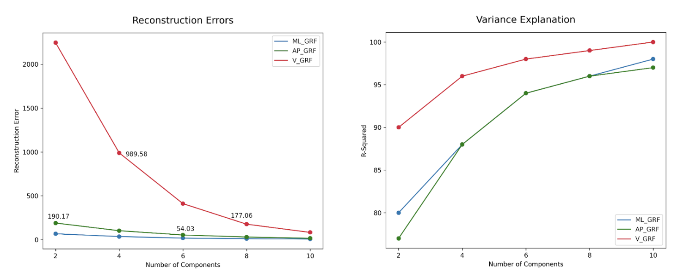

```{r setup, include=FALSE}
knitr::opts_chunk$set(echo = TRUE)

```
Access the codes at : [github: https://github.com/pruthvibharadwaj93/679-physical-therapy]

## Exploration of ML based Dimensionality Reduction techniques for functional data

# Abstract

For this project we worked with Kerry Costello, PhD, a postdoctoral scholar in the Movement and Applied Imaging Lab at Sargent College, BU. As a part of her research work, she is working on a project to predict MRI Osteoarthritis Knee Score (MOAKS) using gait and physical activity measures. Identifying knees at risk of worsening osteoarthritis could help to identify individuals in need of interventions. Specifically, demographic and clinical data, ground reaction force data obtained through self-selected speed walking and physical activity data from 7 days of accelerometer wear collected from patients with and without knee pain is being used for modeling. The ground reaction force, along with the center of pressure and moments, was represented as functional data with high dimensionality (p=100). The client had previously tried to extract features manually from this data to use it as predictors in predictive modeling. However, she wanted to know if there are other automatic ways of generating features. Our project was to explore Machine Learning based dimensionality reduction techniques for the functional data (p=2990 and p=100). In the initial stages of our project, we worked on Functional Principal Component Analysis and Multivariate Functional Principal Component Analysis which gave us good results. We decided to use these as our baseline models. In the second half of the project, we tried non-linear Neural Network based models, first AutoEncoders and later Variational AutoEncoders.

# Introduction	

The Ground Reaction Force, Center of Pressure and Moments data that was obtained from self-selected speed walking can be thought of as functional data.This allows us to apply the theory and computational tools that are designed for data of this nature. 

Functional data is multivariate data with an ordering on the dimensions. It is intrinsically high dimensional. This poses challenges both for theory and computation. On the other hand, the high or infinite dimensional structure of the data is a rich source of information, which brings many opportunities for research and data analysis. 	
FDA is a branch of statistics that deals with data that can be conceptualized as a function of an underlying, continuous variable. The data in FDA are smooth curves (or surfaces) in time or space. 	
Mathematically, the curves are modeled as functions that live in an infinite dimensional vector space, what the mathematicians call a Hilbert Space. One way to think of this is that you are dealing with the ultimate large p small n problem. Each curve has infinitely many points, not just the 3 or 30 or 3,000 you happen to have.
Data Description

The data we obtained was collected as a part of the Multicenter Osteoarthritis (OA) Study. Participants were required to walk in a self-paced manner on force plates that recorded Ground Reaction Force (GRF), Center of Pressure (COP) and Moment. The variables thus obtained had 2990 columns representing the variable at evenly spaced time points. The variables were then time normalized, and the normalized dataset had 100 dimensions.

GRF had 3 components. (z – Vertical, x – Medial Lateral, y – Anterior Posterior). Moment had 3 components (x,y,z) and COP had 2 components (x and y).

After looking at all of the data we decided to primarily focus our analysis on reducing the dimensions of the time normalized GRF. For the rest of the report, these will be referred to as follows:

GRF_ML = Time normalized dataset for GRF Medial Lateral (x)
GRF_AP = Time normalized dataset for GRF Anterior Posterior (y)
GRF_V = Time normalized dataset for GRF Vertical (z)

The data is visualised in the plots below

<center> 

{width=95%} 

</center> 

\newpage

# Functional Principal Component Analysis

Principal component analysis is a key dimension reduction tool for multivariate data that has been extended to functional data and termed functional principal component analysis (FPCA). FPCA facilitates the conversion of inherently infinite-dimensional functional data to a finite-dimensional vector of random scores. Analogous dimension reduction can be achieved by expanding the functional data into other function bases, such as spline, Fourier, or wavelet bases. Dimension reduction is achieved through an expansion of the underlying observed random trajectories Xi(t) in a functional basis that consists of the eigenfunctions of the (auto)-covariance operator of the process X. FPCA is represented by the formula below.


<center> 

{width=45%} 

</center>


where Aik are the functional principal components (FPCs) of Xi, sometimes referred to as scores. Each of these vectors explains a portion of the total variance in the data. They form an orthonormal basis, which simply means that each datapoint is a linear combination of our principal components. A key feature of PCA is that it focuses on reconstruction: the PCA coefficients for an input are a low dimension representation that can be used to reconstruct an approximation to that input.

We began our analysis by implementing FPCA with the Python package scikit-fda. scikit-fda is a Python package designed specifically for functional data analysis. It has functionalities that enable representation of functional data as discrete or basis expansion Python objects. It also contains functions that can be used for smoothing, registration, dimension reduction and extracting summary statistics.

Our aim was to reduce the 100-dimensions into a few components which were obtained from a chosen basis. We initially tried BSpline basis and Fourier basis. We ran FPCA for all 3 of the GRF directions. We tried using BSplines as well as Fourier basis because of the sinusoidal nature of our data. We then tried to refine the model by trying different numbers of components. We observed that there was a heavy loading on the first components (>80%) for all the variables. For all the variables we observed that we were able to obtain more than 90% variance explanation with just 2 or 3 components. 

When we reconstructed the datasets from the derived components, we recorded the values of the reconstruction errors with different numbers of components. We saw slight differences in the shape of the components for the 2 basis but the variance loading scores and reconstruction errors showed almost no difference and we decided to go ahead with BSpline basis. The reconstruction errors decreased as components increased but after about 8 components, the difference was very small. We decided to go with 8 components with the BSplines basis. The figures below shows the reconstruction errors and the variance explanation ratio for all the models we tried.


### Reconstruction Errors and Variance Explanation Ratios for FPCA models

<center> 

{width=95%} 

</center>

We can see that most of the variance can be explained by about 6 or 7 components, so in the interest of reducing dimensions as much as possible, our final FPCA model had 6 components with the reconstruction errors coming out to be 18.36,  54.03, and 411.42 and the variance explained by the model is 0.94,  0.94, and 0.99 for ML_GRF, AP_GRF and V_GRF respectively. The plot for the  ML_GRF model are given below.

<center> 

{width=65%} 

</center>

The results from FPCA seemed interesting and insightful but we wanted to explore approaches that could reduce the dimensions further or in a more singular direction for all x, y, z dimensions, so we decided to try a multivariate version of the FPCA model.

\newpage

# Multivariate Functional Principal Component Analysis

Multivariate Functional Principal Component Analysis or MFPCA is a dimension reduction model that automatically takes care of any covariation that might exist between the different components. It is similar to FPCA but the input to the model is a combination of all the variables that we want to assess together. 

Simple univariate FPCA captures joint variation between the different kinds of GRF only indirectly, which makes the interpretation of the FPCA results difficult and can give correlated scores that can lead to multicollinearity issues. Multivariate FPCA, by contrast, directly addresses potential covariation between the different GRF elements. The multivariate functional principal components are more natural to represent multivariate functional data in the sense that they have the same structure as each observation.

We used the Python package FDApy for our MFPCA, which is also designed for functional
data analysis. It is more inclusive of irregularly sampled data and has multidimensional aspects. 
It comes with a simulation toolbox that can aid in dimension reduction and clustering. The package is publicly available on the Python Package Index and Github. For our purpose, it contained a full set of functions to develop, visualize and validate our model.

The function we used allowed us to choose how much of the variance we wanted explained and it chose the components automatically, or we could define how many components we wanted. If we chose the variance explained to be 95%, the model automatically chose 10 components for each GRF.

We tried different numbers of components for each individual GRF direction and recorded the reconstruction errors for each fit for all three GRFs respectively. The reconstruction errors came out to be higher than FPCA, which was expected since for FPCA we had one model per dataset and for MFPCA we were combining three datasets to make one model. The results can be seen in the table below.

It seemed like the errors stopped decreasing a large amount around 8 to 10 components. We chose to go ahead with the model with 8 components to keep the number low and the plot for the MFPCA results is shown below.

Since our data was a multivariate functional dataset of all three directions of GRF combined, it gave us the opportunity to reduce dimensions even further by trying to see if components would overlap between any of those three directions. We chose a total number of components that was divided randomly between the three directions of GRF and ran the model for a number of different values. 

scikit-fda allowed us to calculate the variance explanation rations with an inbuilt function but since the FDApy package is not as properly developed, we had to calculate those manually by defining a function.

The results for the errors and variance explanation values from these models are shown below.

### Reconstruction Errors and Variance Explanation for MFPCA individual components models

<center> 

{width=95%} 

</center>

10 total components gave us the lowest errors and the plot for those 10 components is shown below.
The first three bivariate principal components are shown in the figure above, which explain 84%, 95% and 97% of the variability of ML_GRF, AP_GRF and V_GRF, respectively,  in the data, give insight into the main modes of joint variation in the overall force on the knee by the ground. The corresponding scores do not only allow a more parsimonious representation of the data (one score value per bivariate principal component and per observation), but they are also uncorrelated by construction. 


<center> 

{width=95%} 

</center>


The figure below shows a 10 component model for combined GRF directions.

<center> 

{width=95%} 

</center>


Overall, even though it was a great concept and a very good fit for our specific data and the problem we were trying to solve, using the FDApy package was somewhat a frustrating task. It was not properly developed, there were not many options available to alter the built in model and it was hard to load and get to work in the first place as well. After getting our MFPCA results we wanted to explore more options that might give us better results with possibly smaller errors. 

PCA’s linearity, also, inhibits its ability to efficiently reduce the dimensionality of data when non-linearities are present. In theory, PCA is quite similar to a single layered autoencoder with a linear activation function, so we wanted to take it one step further and try out an autoencoder. 

\newpage

# AutoEncoder

Next, we tried a simple Autoencoder. Autoencoders are unsupervised Artificial Neural Networks that can be used for dimension reduction by attempting to encode the input data by compressing it into the lower dimensions, which is the bottleneck layer,  and then decoding the data to reconstruct the original input. The bottleneck layer gives us the reduced representation of our input data.

Autoencoders are feed-forward neural networks that learn efficient encodings of data in an unsupervised manner. An autoencoder consists of two parts: an encoder that takes data as input and compresses it to produce a latent representation, followed by a decoder that takes the latent representation and decompresses it to produce a reconstruction of the original data. It must find a compression that allows the input data to be approximately reconstructed. This compression is tailored for the data set that the autoencoder is trained on, thus the latent representation often reflects meaningful properties of the data.

<center> 

{width=95%} 

</center>

Figure above depicts a simple autoencoder that takes in a four-dimensional input x, compresses it to a two-dimensional latent representation z, and then outputs a four-dimensional reconstruction x. 

The latent representations can be thought of as occupying a latent space: this space is the range of the encoder and domain of the decoder. PCA reconstruction can be thought of as a restricted autoencoder. In this case, the encoder projects the data onto the first n PCA components, giving a low-dimensional latent representation: the projection coefficients. The corresponding decoder then returns the linear combination of the first n PCA components with these coefficients as the reconstruction of the input. Training PCA reconstruction consists of finding the first n PCA components: of all the possible bases of n vectors, the first n PCA components are the basis that minimizes the mean squared reconstruction error. In an autoencoder, the encoder and decoder can learn more complex operations than projection and linear combination, allowing the autoencoder to capture non-linear features of the data.

The Python package we used for our analysis was torch. torch is an optimized library for deep learning and tensor computation with strong GPU acceleration. It is a popular open source library for performing machine learning operations, and was developed by Facebook AI. Another option we considered was the Keras library but after some trial and error and some research, PyTorch seemed to be the way to go since it gave greater flexibility, even though it was more complex to figure out initially.

After getting the environment set up with the required packages, we then built a basic structure for our model. The encoder layer had a 100 unit input layer, 64 units in the first hidden layer, 32 units in the 2nd hidden layer and a 2 unit encoded output layer (reduced dimensions). The decoder had 32 hidden units in the 1st layer, 64 in the next and outputted 100 units, which carried the reconstructed dataset from the encoder.

After we set up our network and trained our model, we plotted the results and they did not show clear patterns. We had to tweak the output layers and the shape to get the best version we could. We recorded reconstruction errors for the different number of components we tried and the results are given in the table below.

### Reconstruction Errors for AE models

<center> 

{width=95%} 
</center> 

It seemed that the model with the lowest reconstruction error had an encoded layer of 6 units. 

### Reconstruction plots from AE

<center> 

{width=95%} 
</center> 

All in all, the autoencoder gave us very unstable results. The output was varying every time we retrained the model and the reconstruction errors were very high. We wanted to try improving this model by trying a more flexible approach.

\newpage


# Variational AutoEncoder

Variational autoencoders are a specific subclass of autoencoders. VAEs have an encoder that returns a low-dimensional latent representation of a given input and a decoder that returns a reconstruction given that latent representation. We can use the decoder to construct a synthetic data for any point in the latent space.


<center> 

{width=95%} 

</center> 


In a variational autoencoder inputs get mapped onto a distribution in latent space, rather than a single point. Without this change, the latent space may not be continuous, as inputs can simply be mapped to disjoint points in latent space. By mapping inputs to distributions, similar inputs are allowed to have overlapping distributions, allowing interpolation between them. The latent layer is replaced with two sets of neurons: one representing the means in each of the dimensions of latent space, the other representing the log variances (log variances are used to guarantee that the variances are positive). We will refer to these values as the latent means and latent log variances. The decoder samples a point in latent space from this Gaussian distribution and then decodes it as the reconstruction. 

### Comparison between AE and VAE


<center> 

{width=95%} 

</center> 


The VAE that we used was inspired by a Physics paper “Dimensionality Reduction of SDSS Spectra with Variational Autoencoders”  in which they had applied VAE to galactic spectral data. 
The model was built using pytorch. We wrote a training loop that trained 100 different models each for dimension sizes 2,4,6,8 and 10. Each of these models had a randomly chosen regularization parameter and number of hidden units. We then selected the best model (lowest test MSE) and the results for these are shown in the charts below. Reconstructions for the 10th observation, which was arbitrarily chosen, showed that they get better as dimensions increase. From the performance charts it can be seen that 6 dimensions seems to be ideal. 

The VAE latent space is interpretable because the VAE can be used to make synthetic data at any point in latent space.

### Reconstruction Errors for VAE models


<center> 

{width=95%} 

</center> 


VAE models took a substantial time to train (~6hrs for VGRF and ~12 hrs each for ML and AP GRF). But once trained, VAEs enable the fast exploration of functional data. 

### Outlier analysis on VAE latent space


As a directional next step we ran an Local Outlier Factor algorithm on the latent space and identified top 10 Outliers. The LOF algorithm is unsupervised and it estimates the local density of each point by using k nearest neighbors and then identifies points with densities much lower than their neighbors’ as outliers. We used LOF with k = 20 nearest neighbors and the top ten outliers are shown in the figure below. 

<center> 

{width=95%} 

</center> 

Directionally, if an outlier analysis on the latent space can reveal problematic knees it would indicate that VAE latent spaces do capture differences in knees and can be used to separate good knees from bad knees. 

\newpage 

# Conclusion:
 
All in all, each approach we tried came with its own set of drawbacks as well as unique advantages of using it. In general, PCA techniques are quicker and less expensive to compute than autoencoders. Because of the large number of parameters, the autoencoder is prone to overfitting. 
FPCA gave us low reconstruction errors and was simple and easy to use, but it did not offer the multivariate advatage that MFPCA did. In actuality, MFPCA allowed us to reduce dimensions to the lowest form with the simplest approach and it was in fact the only approach we tried that allowed us to observe all three directions of GRF and any overlaps between them. But the reconstruction errors from MFPCA were large, especially when we looked at a small number of combined dimensions for all three directions.

Autoencoders are good for capturing non-linearities in the data. But they computationally expensive. SImple autoencoders are unstable and generally have high losses after training. VAEs provide a much better alternative. They produce a distribution instead of point estimates and allow for variance to be taken into account. The latent distributions can then be used for further analysis. VAE latent spaces are also interpretable. 

The VAEs that we built had the best performance among all models and FPCA came very close (only in a couple of instances FPCA performed better than VAEs). If we need a simpler model we need to choose FPCA and if we need a model that captures complex relations we need to choose VAE.

\newpage

# References

### FDA and FPCA::
https://arxiv.org/abs/1507.05135 

https://rviews.rstudio.com/2021/05/04/functional-data-analysis-in-r/

### MFPCA:
https://arxiv.org/abs/1509.02029

### AE:
https://www.analyticsvidhya.com/blog/2021/06/dimensionality-reduction-using-autoencoders-in-python/

https://github.com/techshot25/Autoencoders/blob/master/simple-autoencoder.ipynb

### VAE:
https://towardsdatascience.com/understanding-variational-autoencoders-vaes-f70510919f73

https://github.com/stephenportillo/SDSS-VAE/blob/master/SDSS-VAE.ipynb

https://arxiv.org/pdf/2002.10464.pdf

### Packages:

https://fda.readthedocs.io/en/latest/apilist.html

https://fdapy.readthedocs.io/en/latest/

https://github.com/StevenGolovkine/FDApy/tree/master/FDApy

https://pypi.org/project/torch/

\newpage

# Appendix

## Comparison of MSEs for all the models

<center> 

{width=95%} 

</center> 

## Comparison of R2 for all models

<center> 

{width=95%} 

</center> 

## Reconstruction plots for VAE

<center> 

{width=95%} 

</center> 

<center> 

{width=95%} 

</center> 

<center> 

{width=95%} 

</center> 

<center> 

{width=95%} 

</center> 

<center> 

{width=95%} 

</center> 

## MFPCA model with 8 components each for 3 GRF directions

<center> 

{width=95%} 

</center>


